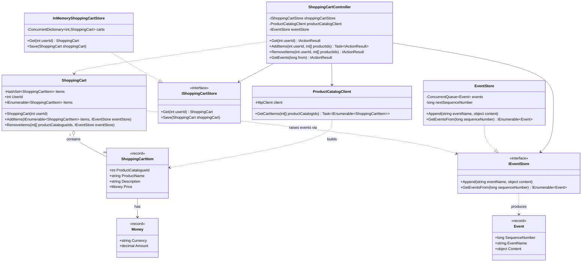

# Shopping Cart – Class Diagram

This diagram shows the classes, records, and interfaces of the Shopping Cart
microservice on this branch (`book-reference/flat-structure`), where everything
lives in a single flat project following the book's chapter 2 layout. See
`package-diagram.md` for the higher-level project view.

> For the Clean Architecture variant (Domain/Application/Infrastructure/API with
> use-case handlers and ports), see the `main` branch. This branch is the "before"
> (book) side of a before/after comparison.

## Notes

- **Records** (`ShoppingCartItem`, `Money`, `Event`) use the `<<record>>` stereotype — immutable, data-carrying types.
- **The domain object raises its own events.** `ShoppingCart.AddItems`/`RemoveItems` receive an `IEventStore` and append `CartItemAdded`/`CartItemRemoved` events directly. There is no separate Application layer between the controller and the domain (contrast with the Clean Architecture branch, ADR-0002).
- **The controller does all orchestration inline** — it depends directly on the store, the product catalog client, and the event store, with no use-case/handler classes in between.
- **`ProductCatalogClient` has no interface** — the controller depends on the concrete class. Only `IShoppingCartStore` and `IEventStore` are kept as thin interfaces, matching the book, so DI registration reads naturally.
- **`ShoppingCart` and its namespace share the name `ShoppingCart`** (the project's root namespace) — this is exactly how the book structures it; C# resolves the type within the namespace without conflict.
- Multiplicity `ShoppingCart "1" o-- "many" ShoppingCartItem` reflects that a cart aggregates zero or more items (backed by a `HashSet<ShoppingCartItem>` in the implementation).
