# Shopping Cart – Class Diagram

This diagram shows the main classes, records, and interfaces across all layers, and how they relate. See `package-diagram.md` for the higher-level project/layer view.

```mermaid
classDiagram
    %% ===== Domain =====
    class Cart {
        +int UserId
        +IEnumerable~CartItem~ Items
        +Cart(int userId)
        +AddItems(IEnumerable~CartItem~ items)
        +RemoveItems(int[] productCatalogueIds)
    }

    class CartItem {
        <<record>>
        +int ProductCatalogueId
        +string ProductName
        +string Description
        +Money Price
    }

    class Money {
        <<record>>
        +string Currency
        +decimal Amount
    }

    Cart "1" o-- "many" CartItem : contains
    CartItem --> Money : has

    %% ===== Application: Ports =====
    class ICartRepository {
        <<interface>>
        +Get(int userId) Cart
        +Save(Cart cart)
    }

    class IProductCatalogClient {
        <<interface>>
        +GetCartItems(int[] productCatalogIds) Task~IEnumerable~CartItem~~
    }

    class IEventStore {
        <<interface>>
        +Append(string eventName, object content)
        +GetEventsFrom(long sequenceNumber) IEnumerable~Event~
    }

    class Event {
        <<record>>
        +long SequenceNumber
        +string EventName
        +object Content
    }

    IEventStore ..> Event : produces

    %% ===== Application: Use cases =====
    class AddItemsToCartCommand {
        <<record>>
        +int UserId
        +int[] ProductIds
    }

    class AddItemsToCartHandler {
        -ICartRepository cartRepository
        -IProductCatalogClient productCatalogClient
        -IEventStore eventStore
        +Handle(AddItemsToCartCommand command) Task~Cart~
    }

    class GetCartQuery {
        <<record>>
        +int UserId
    }

    class GetCartHandler {
        -ICartRepository cartRepository
        +Handle(GetCartQuery query) Cart
    }

    class RemoveItemsFromCartCommand {
        <<record>>
        +int UserId
        +int[] ProductCatalogueIds
    }

    class RemoveItemsFromCartHandler {
        -ICartRepository cartRepository
        -IEventStore eventStore
        +Handle(RemoveItemsFromCartCommand command) Cart
    }

    class GetEventsQuery {
        <<record>>
        +long FromSequenceNumber
    }

    class GetEventsHandler {
        -IEventStore eventStore
        +Handle(GetEventsQuery query) IEnumerable~Event~
    }

    AddItemsToCartHandler --> ICartRepository
    AddItemsToCartHandler --> IProductCatalogClient
    AddItemsToCartHandler --> IEventStore
    AddItemsToCartHandler ..> AddItemsToCartCommand
    AddItemsToCartHandler ..> Cart

    GetCartHandler --> ICartRepository
    GetCartHandler ..> GetCartQuery
    GetCartHandler ..> Cart

    RemoveItemsFromCartHandler --> ICartRepository
    RemoveItemsFromCartHandler --> IEventStore
    RemoveItemsFromCartHandler ..> RemoveItemsFromCartCommand
    RemoveItemsFromCartHandler ..> Cart

    GetEventsHandler --> IEventStore
    GetEventsHandler ..> GetEventsQuery

    %% ===== Infrastructure =====
    class InMemoryCartRepository {
        -ConcurrentDictionary~int,Cart~ carts
        +Get(int userId) Cart
        +Save(Cart cart)
    }

    class ProductCatalogClient {
        -HttpClient client
        +GetCartItems(int[] productCatalogIds) Task~IEnumerable~CartItem~~
    }

    class InMemoryEventStore {
        -ConcurrentQueue~Event~ events
        -long nextSequenceNumber
        +Append(string eventName, object content)
        +GetEventsFrom(long sequenceNumber) IEnumerable~Event~
    }

    InMemoryCartRepository ..|> ICartRepository
    ProductCatalogClient ..|> IProductCatalogClient
    InMemoryEventStore ..|> IEventStore

    %% ===== API =====
    class CartController {
        -GetCartHandler getCartHandler
        -AddItemsToCartHandler addItemsToCartHandler
        -RemoveItemsFromCartHandler removeItemsFromCartHandler
        -GetEventsHandler getEventsHandler
        +Get(int userId) IActionResult
        +AddItems(int userId, int[] productIds) Task~IActionResult~
        +RemoveItems(int userId, int[] productIds) IActionResult
        +GetEvents(long from) IActionResult
    }

    CartController --> GetCartHandler
    CartController --> AddItemsToCartHandler
    CartController --> RemoveItemsFromCartHandler
    CartController --> GetEventsHandler
```

## Notes

- **Records** (`CartItem`, `Money`, `Event`, and all Commands/Queries) are shown with the `<<record>>` stereotype — they are immutable, data-carrying types.
- **Interfaces** (`ICartRepository`, `IProductCatalogClient`, `IEventStore`) are the *ports* defined in the Application layer (ADR-0001). The `..|>` arrows show Infrastructure classes implementing them.
- **Use case handlers** depend only on the ports (interfaces), never on the concrete Infrastructure classes — this is the Dependency Inversion Principle in action.
- `CartController` (API layer) depends only on the four use case handlers, keeping it thin — it has no direct knowledge of `Cart`, the ports, or their implementations.
- Multiplicity `Cart "1" o-- "many" CartItem` reflects that a cart aggregates zero or more items (backed by a `HashSet<CartItem>` in the implementation).
