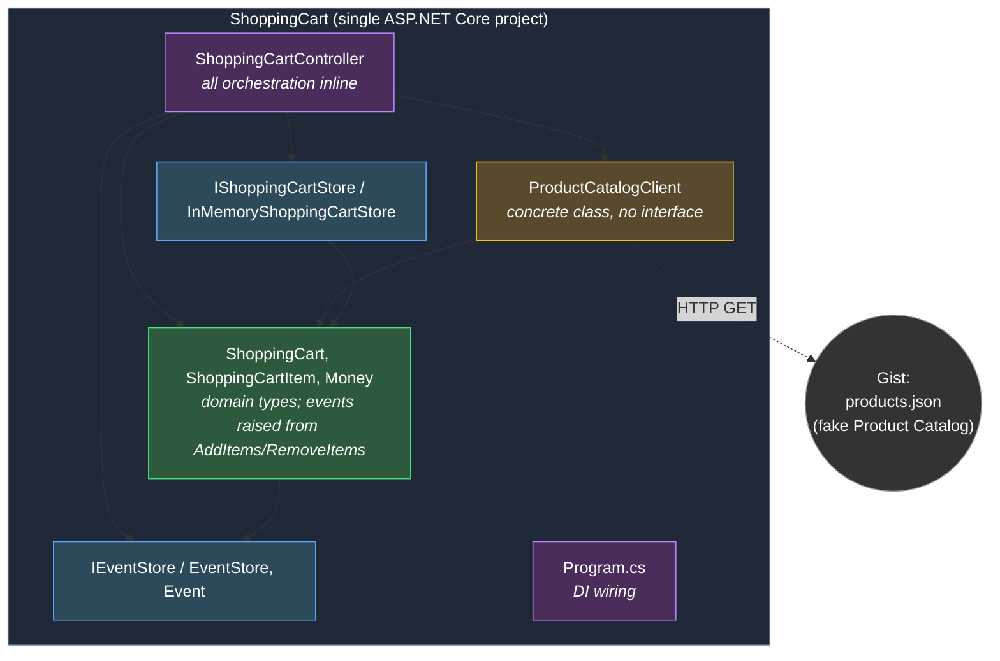

# Shopping Cart – Package Diagram

This diagram shows the project structure of the Shopping Cart microservice on this
branch (`book-reference/flat-structure`): a **single, flat ASP.NET Core project**
that mirrors how the book (*Microservices in .NET*, 2nd ed., chapter 2) builds the
service. There is no separate Domain/Application/Infrastructure/API split — all
source files live directly in one project.

> For the Clean Architecture variant (four projects), see the `main` branch and
> its ADRs. This branch exists as the "before" (book) side of a before/after
> comparison.

## Notes

- **One project, no layer boundaries.** Everything compiles into a single assembly. Types reference each other directly, without project references or a dependency-inversion boundary between "application" and "infrastructure".
- **The controller orchestrates directly.** `ShoppingCartController` fetches the cart, calls `ProductCatalogClient`, mutates the domain object, saves it, and reads events — there are no separate use-case/handler classes.
- **The domain raises its own events.** `ShoppingCart.AddItems`/`RemoveItems` take an `IEventStore` and append events themselves, rather than an Application layer doing it (contrast with ADR-0002 on `main`).
- **`ProductCatalogClient` is used as a concrete class** — no `IProductCatalogClient` port. `IShoppingCartStore` and `IEventStore` are kept only as thin interfaces so the DI registration reads naturally, as the book itself does.
- **No test projects** on this branch — the book's chapter 2 layout is a single project, and the two (empty) test projects were removed here to keep the flat structure faithful. The Clean Architecture branch keeps them.
- The service still makes an outbound HTTP call to a GitHub Gist acting as a fake Product Catalog microservice (ADR-0004).
