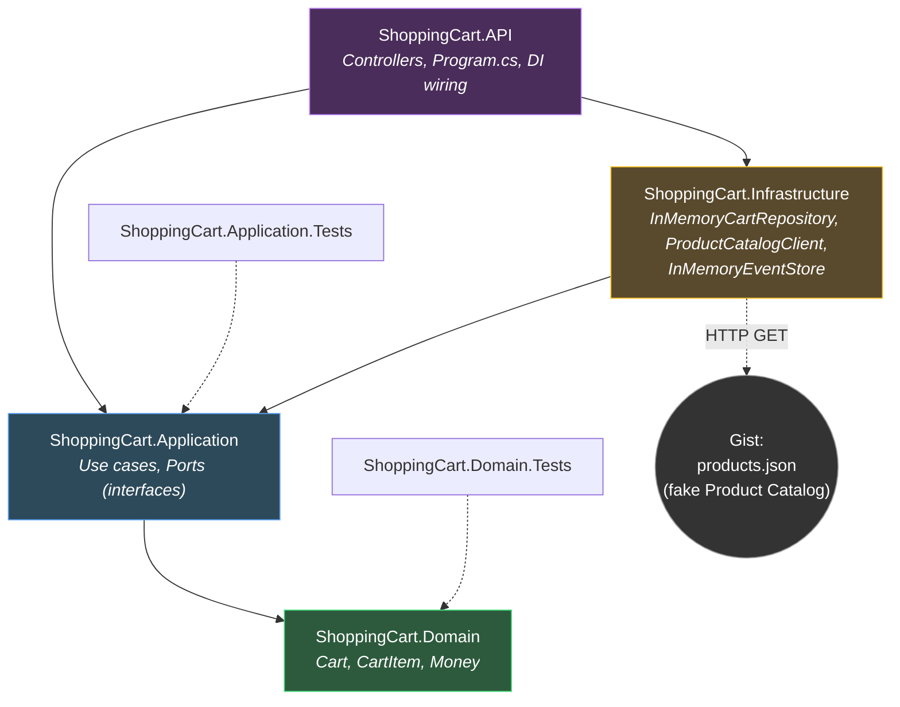

# Shopping Cart – Package Diagram

This diagram shows the current project structure of the Shopping Cart microservice, following Clean Architecture layering (see ADR-0001). Arrows indicate project references (dependency direction).

## Notes

- **Domain** has zero outward dependencies — no reference to any other project (ADR-0001).
- **Application** depends only on **Domain**. It defines *ports* (`ICartRepository`, `IProductCatalogClient`, `IEventStore`) that describe what it needs from the outside world, without knowing how those needs are fulfilled (Dependency Inversion Principle).
- **Infrastructure** depends on **Application**, implementing its ports with concrete technology choices (in-memory storage, HTTP client). It does not depend on **API**.
- **API** depends on both **Application** (to call use case handlers) and **Infrastructure** (only in `Program.cs`, for dependency injection wiring). Controllers only ever call into **Application**.
- **Infrastructure** makes an outbound HTTP call to a GitHub Gist acting as a fake Product Catalog microservice (ADR-0004).
- Test projects reference only the layer they test, keeping tests isolated from framework and infrastructure concerns.
